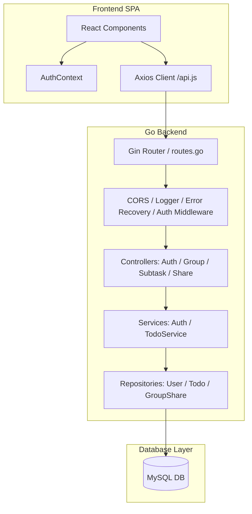
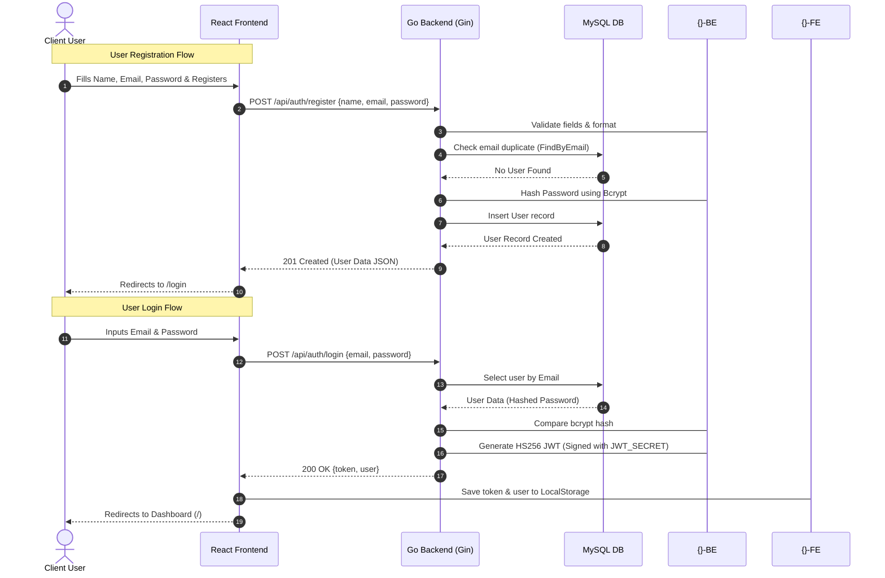
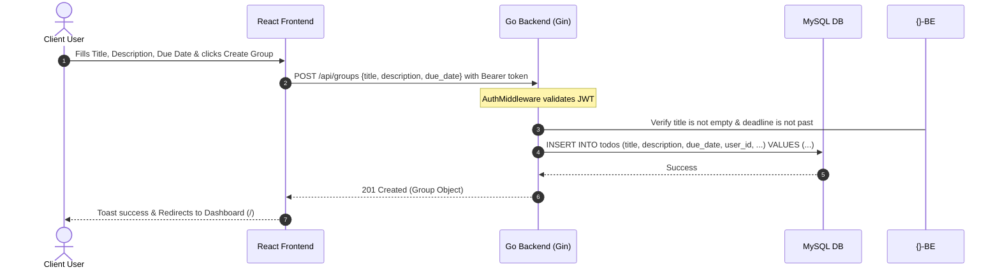
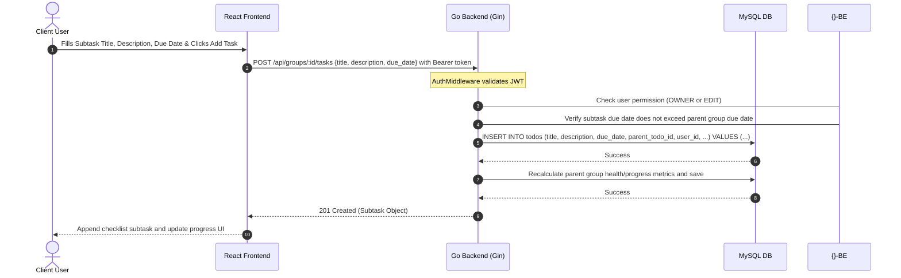
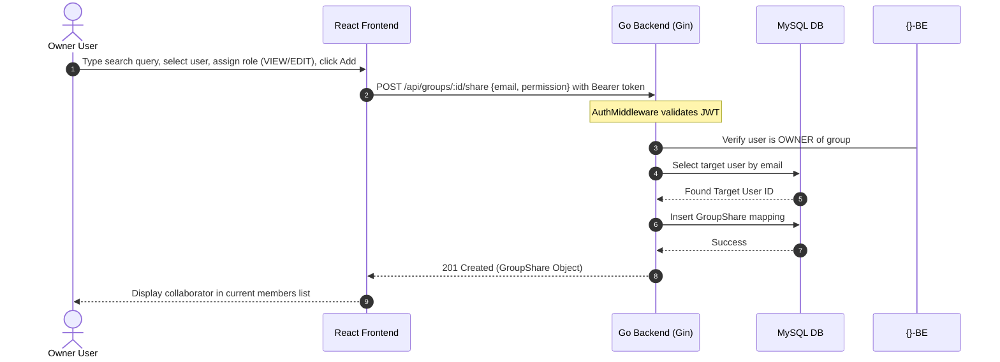

# Technical Walkthrough & Architecture Document: Todo & Project Group Application

This document provides a comprehensive analysis of the architecture, data flows, execution cycles, and implementation patterns of the Collaborative Todo & Project Group Application.

---

## 1. Application Overview

### Purpose
The Project Group & Todo Application is a secure, multi-user, collaborative task management platform. It allows users to organize their activities into project groups, create detailed checklists of subtasks, set deadlines, track dynamic project health statuses, and collaborate with other users using permission roles (OWNER, EDIT, VIEW).

### Main Features
1. **User Authentication**: Secure registration and login workflows using client-side JWT persistence and server-side bcrypt password hashing.
2. **Project Groups Management**: CRUD operations for parent task groups containing titles, descriptions, and overall project deadlines.
3. **Subtask Checklists**: Fine-grained checklists under groups with individual deadlines and completion states.
4. **Dynamic Progress & Health Tracking**: 
   - Real-time progress percentage based on completed subtasks.
   - Dynamic health status computation (`COMPLETED`, `ON_TRACK`, `AT_RISK`, `OVERDUE`) based on remaining days, completion, and overdue subtask alerts.
5. **Collaborative Sharing & Permission Roles**:
   - **OWNER**: Full group control, share management, metadata updates, and subtask administration.
   - **EDIT** (Editor): Can view groups, add subtasks, edit subtasks, and toggle status.
   - **VIEW** (Viewer): Read-only checklist and metadata access.
6. **Summary Dashboards**: Dashboard categorization into personal ("My Groups") and shared ("Shared With Me") project boards with real-time status counters.
7. **Filters & Sorting**: Advanced search queries, status filtering (active, completed, overdue, due today, due this week), and sorting methods (date created, deadline, progress, recent update).

### Technologies Used
* **Frontend**: React (v18), Vite, React Router DOM (v6), Axios, Lucide React (icons), and CSS Modules for styling.
* **Backend**: Go (Golang), Gin Gonic (web framework), GORM (Object Relational Mapper), and Go-JWT (`github.com/golang-jwt/jwt/v5`).
* **Database**: MySQL with GORM-based auto-migrations.
* **Testing**: Go unit test suite for service validation.

### High-Level Architecture
The application is built using a decoupled Client-Server architecture composed of the following layers:

1. **Presentation Layer (Frontend SPA)**: A single-page application built in React. It renders views, coordinates page navigation, maintains global authentication state, captures user input actions, performs client-side form validations, manages local state, and fires API requests.
2. **API Routing & Middleware Layer (Backend)**: Exposes endpoints using the Gin Gonic framework. This layer intercepts incoming HTTP traffic, manages CORS settings, logs requests (Logger), recovers from runtime crashes (Recovery), and authenticates JWT tokens (Auth Middleware) before allowing access to protected handlers.
3. **Controller Layer (Backend)**: Serves as the entry gate to the backend logic. It parses route parameters and query strings, deserializes incoming JSON payloads into Go structs, performs basic payload constraint validation, invokes business services, and constructs standard, structured JSON responses (success/failure) for the client.
4. **Business Logic Layer (Services)**: Houses the core business rules and calculations of the application. It validates logic boundaries (such as ensuring deadline times are not in the past), resolves permission roles relative to resources (checking if a user is OWNER, EDIT, or VIEW), updates project progress levels, and orchestrates repository actions.
5. **Data Access / Repository Layer (Backend)**: Provides clean data-access abstractions using GORM. This layer isolates SQL logic from business code, running database actions (insertions, counts, queries, preloading relationships, cascading deletions, and ordering rules) against the MySQL database.
6. **Database Layer**: A MySQL database containing tables, unique indices, and foreign key constraints to securely persist user accounts, groups, checklist subtasks, and collaborative sharing mappings.




---

## 2. Project Structure Analysis

Here is the directory structure analysis detailing the purpose and files of each component.

### Root Directory
* [README.md](file:///d:/Todo%20KreditBee/README.md): Project overview, environment setup requirements, and quick-start scripts.
* [docker-compose.yml](file:///d:/Todo%20KreditBee/docker-compose.yml): **Responsibility**: Orchestration configuration. Coordinates the MySQL database (`db`), Go REST API (`backend`), and React frontend server (`frontend`) in an isolated network environment.

### Backend Structure (`/backend`)
* [Dockerfile](file:///d:/Todo%20KreditBee/backend/Dockerfile): Uses a multi-stage process to compile the Golang source code into a static binary and run it in a clean Alpine container.
* [go.mod](file:///d:/Todo%20KreditBee/backend/go.mod): Lists Go module configurations and dependencies.
* [cmd/main.go](file:///d:/Todo%20KreditBee/backend/cmd/main.go): **Responsibility**: Application entry point. Loads config, establishes the MySQL database pool, auto-migrates tables, sets up router endpoints, and fires up the server.
* [config/config.go](file:///d:/Todo%20KreditBee/backend/config/config.go): **Responsibility**: Configuration loader. Parses environment variables and maps them to a global config struct configuration.
* [database/mysql.go](file:///d:/Todo%20KreditBee/backend/database/mysql.go): **Responsibility**: Database connectivity module. Connects to MySQL using GORM driver, performs cleanups of old categorization schemas, and executes schema auto-migration.
* [database/schema.sql](file:///d:/Todo%20KreditBee/backend/database/schema.sql): **Responsibility**: Reference MySQL DDL schema specifying indices, key constraints, and tables.
* [database/seed.sql](file:///d:/Todo%20KreditBee/backend/database/seed.sql): **Responsibility**: SQL script to populate database with demo users, group tasks, and subtasks.
* [database/migrations/](file:///d:/Todo%20KreditBee/backend/database/migrations/): Database migrations structure.
  - [000001_create_users_table.up.sql](file:///d:/Todo%20KreditBee/backend/database/migrations/000001_create_users_table.up.sql)
  - [000001_create_users_table.down.sql](file:///d:/Todo%20KreditBee/backend/database/migrations/000001_create_users_table.down.sql)
  - [000002_create_todos_table.up.sql](file:///d:/Todo%20KreditBee/backend/database/migrations/000002_create_todos_table.up.sql)
  - [000002_create_todos_table.down.sql](file:///d:/Todo%20KreditBee/backend/database/migrations/000002_create_todos_table.down.sql)
  - [000003_create_group_shares_table.up.sql](file:///d:/Todo%20KreditBee/backend/database/migrations/000003_create_group_shares_table.up.sql)
  - [000003_create_group_shares_table.down.sql](file:///d:/Todo%20KreditBee/backend/database/migrations/000003_create_group_shares_table.down.sql)
* [models/user.go](file:///d:/Todo%20KreditBee/backend/models/user.go): **Responsibility**: Defines the GORM and JSON mappings for the [User](file:///d:/Todo%20KreditBee/backend/models/user.go) struct.
* [models/todo.go](file:///d:/Todo%20KreditBee/backend/models/todo.go): **Responsibility**: Defines the GORM mappings for the [Todo](file:///d:/Todo%20KreditBee/backend/models/todo.go) struct, which represents both a Group and a Subtask through self-referential parent key relationships.
* [models/group_share.go](file:///d:/Todo%20KreditBee/backend/models/group_share.go): **Responsibility**: Defines the GORM schema mapping for collaborative sharing permissions ([GroupShare](file:///d:/Todo%20KreditBee/backend/models/group_share.go)).
* [middleware/auth_middleware.go](file:///d:/Todo%20KreditBee/backend/middleware/auth_middleware.go): **Responsibility**: Authorization gatekeeper. Extracts Bearer token, validates claims, and injects user identity into Gin context.
* [middleware/error_middleware.go](file:///d:/Todo%20KreditBee/backend/middleware/error_middleware.go): **Responsibility**: Global panic recovery. Catches unhandled runtime panics and converts them to standard 500 JSON errors.
* [middleware/logger_middleware.go](file:///d:/Todo%20KreditBee/backend/middleware/logger_middleware.go): **Responsibility**: API Request logger recording HTTP status, path, latency, method, and IP.
* [controllers/auth_controller.go](file:///d:/Todo%20KreditBee/backend/controllers/auth_controller.go): **Responsibility**: HTTP handler wrapper for authentication. Binds registration and login payloads and triggers authentication services.
* [controllers/group_controller.go](file:///d:/Todo%20KreditBee/backend/controllers/group_controller.go): **Responsibility**: HTTP handler for project group CRUD actions.
* [controllers/subtask_controller.go](file:///d:/Todo%20KreditBee/backend/controllers/subtask_controller.go): **Responsibility**: HTTP handler for checklist subtask actions.
* [controllers/share_controller.go](file:///d:/Todo%20KreditBee/backend/controllers/share_controller.go): **Responsibility**: HTTP handler for sharing administration (invites, user searches, revoking members).
* [services/auth_service.go](file:///d:/Todo%20KreditBee/backend/services/auth_service.go): **Responsibility**: Enforces password requirements, validates format bounds, checks duplicates, and coordinates hashing/token issuing.
* [services/todo_service.go](file:///d:/Todo%20KreditBee/backend/services/todo_service.go): **Responsibility**: Business logic wrapper around group and subtask checklists management, permission role evaluations, progress calculation, and health indicators updates.
* [services/todo_service_test.go](file:///d:/Todo%20KreditBee/backend/services/todo_service_test.go): **Responsibility**: Service test suite checking deadline progress, health status logic, and days calculations.
* [repositories/user_repository.go](file:///d:/Todo%20KreditBee/backend/repositories/user_repository.go): **Responsibility**: Direct database operations for querying and persisting users.
* [repositories/todo_repository.go](file:///d:/Todo%20KreditBee/backend/repositories/todo_repository.go): **Responsibility**: Database queries for tasks and subtasks including sorting rules, status filters, and preloads.
* [repositories/group_share_repository.go](file:///d:/Todo%20KreditBee/backend/repositories/group_share_repository.go): **Responsibility**: Coordinates membership count lookups, shared group queries, and share definitions.
* [routes/routes.go](file:///d:/Todo%20KreditBee/backend/routes/routes.go): **Responsibility**: Declares paths, sets CORS policy, executes dependency injection, and connects controllers to routes.
* [utils/jwt.go](file:///d:/Todo%20KreditBee/backend/utils/jwt.go): **Responsibility**: Signs HS256 tokens and decodes claims.
* [utils/password.go](file:///d:/Todo%20KreditBee/backend/utils/password.go): **Responsibility**: Bcrypt wrapper for encryption and verification checks.

### Frontend Structure (`/frontend`)
* [Dockerfile](file:///d:/Todo%20KreditBee/frontend/Dockerfile): Builds the production bundle of the React app using Node environment and packages it inside an Nginx container.
* [nginx.conf](file:///d:/Todo%20KreditBee/frontend/nginx.conf): **Responsibility**: Nginx configuration. Handles frontend static asset delivery and redirects SPA routes to `index.html`.
* [main.jsx](file:///d:/Todo%20KreditBee/frontend/src/main.jsx): React mounting execution node.
* [App.jsx](file:///d:/Todo%20KreditBee/frontend/src/App.jsx): Declares page routes, defines public vs protected pathways, and sets Layout wrapper boundaries.
* [index.css](file:///d:/Todo%20KreditBee/frontend/src/index.css): Core global typography, custom scrollbars, spin animations, and foundational design rules.
* [context/AuthContext.jsx](file:///d:/Todo%20KreditBee/frontend/src/context/AuthContext.jsx): Context API provider managing user authentication state, logins, registrations, and logouts.
* [services/api.js](file:///d:/Todo%20KreditBee/frontend/src/services/api.js): Configure axios client, adds authentication headers globally via request interceptors, and redirects user to login on 401s via response interceptors.
* [components/ProtectedRoute.jsx](file:///d:/Todo%20KreditBee/frontend/src/components/ProtectedRoute.jsx): Gated entry component that evaluates authentication status and redirects guest accesses to `/login`.
* [components/Layout/Layout.jsx](file:///d:/Todo%20KreditBee/frontend/src/components/Layout/Layout.jsx): Application layout structure featuring a sidebar navigation, header context, mobile navigation drawer, and slot content injection.
* [components/Toast/Toast.jsx](file:///d:/Todo%20KreditBee/frontend/src/components/Toast/Toast.jsx): Time-dismissed, stylized banner component indicating success or failure events.
* [pages/Login/LoginPage.jsx](file:///d:/Todo%20KreditBee/frontend/src/pages/Login/LoginPage.jsx): User entry credentials form with client-side validation logic.
* [pages/Register/RegisterPage.jsx](file:///d:/Todo%20KreditBee/frontend/src/pages/Register/RegisterPage.jsx): Direct account registration page validating password matches and text inputs.
* [pages/Dashboard/DashboardPage.jsx](file:///d:/Todo%20KreditBee/frontend/src/pages/Dashboard/DashboardPage.jsx): Group overview console containing summary status widgets, search inputs, active sorting selectors, and list sections for owned and shared projects.
* [pages/TodoForm/TodoFormPage.jsx](file:///d:/Todo%20KreditBee/frontend/src/pages/TodoForm/TodoFormPage.jsx): Shared form supporting both creation and update phases of project groups.
* [pages/Groups/GroupDetailsPage.jsx](file:///d:/Todo%20KreditBee/frontend/src/pages/Groups/GroupDetailsPage.jsx): Checklist space. Visualizes deadlines alarms, checklists filters, subtask creation/editing controls, progress bars, and collaborative sharing actions modal.
* [pages/Profile/ProfilePage.jsx](file:///d:/Todo%20KreditBee/frontend/src/pages/Profile/ProfilePage.jsx): Renders user details from global state.

---

## 3. Frontend Workflow

### Startup & Mounting
1. **Index Initialization**: The browser loads `/index.html` which loads [main.jsx](file:///d:/Todo%20KreditBee/frontend/src/main.jsx).
2. **Provider Wrapping**: [main.jsx](file:///d:/Todo%20KreditBee/frontend/src/main.jsx) mounts `<App />` within `React.StrictMode`.
3. **Context Bootstrapping**: [App.jsx](file:///d:/Todo%20KreditBee/frontend/src/App.jsx) establishes `<BrowserRouter>` and wraps it inside `<AuthProvider>` from [AuthContext.jsx](file:///d:/Todo%20KreditBee/frontend/src/context/AuthContext.jsx).
4. **Token Check**: `<AuthProvider>` triggers its `useEffect` hook:
   - It checks `localStorage` for `token` and `user` data.
   - If both are present, it updates the state `user` using `setUser(JSON.parse(storedUser))`.
   - It sets the `loading` state to `false`.

### Routing Flow
* Public paths `/login` and `/register` bypass authorization gates.
* Protected paths `/`, `/groups`, `/groups/:id`, `/create`, `/edit/:id`, and `/profile` are enclosed by `<ProtectedRoute>` and `<Layout>`:
  - If `loading` is true, `<ProtectedRoute>` renders a loading spinner.
  - If `user` is null, it renders `<Navigate to="/login" replace />`.
  - If `user` is authenticated, it mounts the page components inside `<Layout>`.

### Authentication Flow
1. **Validation & Request**: When credentials are submitted via [LoginPage.jsx](file:///d:/Todo%20KreditBee/frontend/src/pages/Login/LoginPage.jsx), it triggers `login(email, password)` in [AuthContext.jsx](file:///d:/Todo%20KreditBee/frontend/src/context/AuthContext.jsx).
2. **Response Persistence**: On HTTP success, the context writes `token` and JSON-serialized `user` data to `localStorage`, updates the `user` state, and returns `{ success: true }`.
3. **Redirect**: The page intercepts the success response and triggers `navigate('/')`.
4. **Logout Lifecycle**: Triggering the logout button calls `logout()` in the context which removes storage keys, updates `setUser(null)`, and redirects to `/login`.

### State Management Flow
* **Global Auth State**: Managed in [AuthContext.jsx](file:///d:/Todo%20KreditBee/frontend/src/context/AuthContext.jsx) via React context hook.
* **Local Component State**: Managed via standard `useState` hooks for search filters, forms, loadings, alerts, and pages.
* **Sync Strategy**: Fetch triggers are executed by page hooks reacting to variable changes (e.g. search term, sorting parameter, or status filter update in Dashboard).

### API Communication Flow
* Utilizes [api.js](file:///d:/Todo%20KreditBee/frontend/src/services/api.js) wrapper for all endpoints.
* Automatic injection of JWT token using Axios request interceptors.
* Centralized handling of unauthorized requests (401 errors) in Axios response interceptors to clear local storage and force redirect to login page.

---

### Page Details & User Interactions

#### 1. Login Page
* **User Actions**: User types email/password, submits form, or clicks registration link.
* **Validation**: Mandatory field checks; basic regex verification for email formats.
* **API Requests**: Triggers `POST /api/auth/login` containing `email` and `password`.
* **State Updates**: Updates input fields, handles validation errors list, and updates global user states.

#### 2. Register Page
* **User Actions**: Fills out registration form (name, email, password, and confirmation).
* **Validation**: Verifies non-empty name, email format, minimum 8 characters password, and matching password strings.
* **API Requests**: Calls `POST /api/auth/register`.
* **Navigation**: Upon successful creation, triggers success Toast and navigates user to `/login` after a `1.5s` delay.

#### 3. Dashboard
* **User Actions**:
  - Type search query (debounced execution after 300ms).
  - Select status filters (all, active, completed, overdue, due-today, due-this-week).
  - Select sorting rules (deadline, deadline-desc, updated, progress, default date created).
  - Delete or edit owned groups.
  - Click summary cards to quickly toggle status filters.
* **API Requests**:
  - `GET /api/groups?...` (fetches owned groups).
  - `GET /api/shared-groups?...` (fetches shared groups).
  - `DELETE /api/groups/:id` (removes group, OWNER only).
* **State Updates**:
  - `myGroups` and `sharedGroups` lists loaded from API responses.
  - Count widgets updated with status counters.
  - Optimistic UI updates remove deleted groups immediately, reverting on network failure.

#### 4. Create / Edit Group Page
* **User Actions**: Modifies group details (title, description, due date) and submits or returns.
* **Validation**: Title is mandatory. Date must be valid.
* **API Requests**: 
  - `GET /api/groups/:id` on mount (if editing) to pre-fill inputs.
  - `POST /api/groups` (if creating) or `PUT /api/groups/:id` (if editing) to submit.
* **Navigation**: Redirects back to dashboard after 1 second on success.

#### 5. Group Details Page (Project checklist workspace)
* **User Actions**:
  - Toggle filters to view subtask checklists (All, Active, Completed).
  - Click "Add New Subtask" button, fill values, and submit.
  - Click checkbox on subtask card to toggle complete/active.
  - Click Edit/Delete subtask buttons.
  - Click "Share Group" to open sharing panel, search users by keyword, add collaborators with roles, or revoke access.
* **API Requests**:
  - `GET /groups/:id` (loads group details, subtasks, user permissions).
  - `GET /groups/:id/members` (loads shared collaborators).
  - `POST /groups/:id/tasks` (adds subtask).
  - `PUT /tasks/:id` (updates subtask).
  - `DELETE /tasks/:id` (deletes subtask).
  - `PATCH /tasks/:id/complete` (toggles subtask status).
  - `GET /users?search=...` (searches collaborative targets).
  - `POST /groups/:id/share` (adds collaborative target).
  - `DELETE /groups/:id/share/:userId` (revokes access).
* **State Updates**:
  - Recalculates total, completed, and progress values locally for immediate UI updates, falling back on database values if api calls fail.
  - Renders alert banners for approaching deadlines and overdue checklist items.

---

## 4. Backend Workflow

This section outlines how requests map through the backend.

### Request Pipeline Stages
1. **Entry**: Router matches request pattern defined in [routes.go](file:///d:/Todo%20KreditBee/backend/routes/routes.go).
2. **Global Middlewares**: Logger records request, Error recovery catches panics, and CORS sets headers.
3. **Route-Specific Middleware**: Authenticated routes pass through [AuthMiddleware](file:///d:/Todo%20KreditBee/backend/middleware/auth_middleware.go) to validate JWT and inject user ID.
4. **Controller Routing**: Matches route to handler wrapper methods (e.g. `groupController.GetGroups`).
5. **Payload Bindings**: Handlers parse query params or bind JSON payloads into typed structs.
6. **Service Layer Execution**: Controllers delegate execution tasks to the services layer (`todoService`), which performs validation and evaluates user permissions.
7. **Repository Execution**: The service delegates database actions to repositories using GORM interfaces.
8. **Response Generation**: Controllers construct standard success or failure JSON payloads.

---

### Endpoint Detailed Workflow Analysis

#### 1. `POST /api/groups`
* **Route**: `/api/groups` -> `GroupController.CreateGroup`
* **Controller**: Binds JSON into `GroupInput`. Calls `todoService.CreateGroup`.
* **Service**: Validates that title is not empty and deadline is not in the past. Calls `todoRepo.Create`.
* **Repository**: Runs GORM insert command: `r.db.Create(group)`.
* **Response**: Returns `201 Created` with the new group struct.

#### 2. `GET /api/groups`
* **Route**: `/api/groups` -> `GroupController.GetGroups`
* **Controller**: Gathers search and status queries. Calls `todoService.GetGroups`.
* **Service**: Fetches groups from `todoRepo.FindAllGroupsByUserID`. Iterates and runs `CalculateGroupHealth` for each group and counts collaborators from `groupShareRepo`.
* **Response**: Returns `200 OK` with lists of groups.

#### 3. `GET /api/groups/:id`
* **Route**: `/api/groups/:id` -> `GroupController.GetGroupByID`
* **Service**: Calls `GetPermission` helper service. Verifies user is owner or collaborator. Reads group and preloads subtasks. Updates progress and health. Returns permission level.
* **Response**: Returns `200 OK` on success, `403 Forbidden` if unauthorized, or `404 Not Found` if missing.

#### 4. `PUT /api/groups/:id`
* **Route**: `/api/groups/:id` -> `GroupController.UpdateGroup`
* **Service**: Verifies permission role is `OWNER`. Updates title, description, due date. Calls `todoRepo.Update`.
* **Response**: Returns `200 OK` with updated details.

#### 5. `DELETE /api/groups/:id`
* **Route**: `/api/groups/:id` -> `GroupController.DeleteGroup`
* **Service**: Verifies permission role is `OWNER`. Calls `todoRepo.Delete` which cascades delete to associated subtasks and share rules.
* **Response**: Returns `200 OK` confirmation.

#### 6. `POST /api/groups/:id/tasks`
* **Route**: `/api/groups/:id/tasks` -> `SubtaskController.CreateSubtask`
* **Service**: Verifies user is `OWNER` or `EDIT`. Validates deadline is not in past and doesn't exceed group's overall project deadline. Saves subtask with `parent_todo_id = id`. Triggers group health and progress recalculations.
* **Response**: Returns `201 Created` with subtask data.

#### 7. `PATCH /api/tasks/:id/complete`
* **Route**: `/api/tasks/:id/complete` -> `SubtaskController.ToggleCompleteSubtask`
* **Service**: Verifies user is `OWNER` or `EDIT`. Toggles subtask completion boolean. Saves subtask. Recalculates and updates parent group progress and health state.
* **Response**: Returns `200 OK`.

#### 8. `POST /api/groups/:id/share`
* **Route**: `/api/groups/:id/share` -> `ShareController.ShareGroup`
* **Service**: Verifies user is `OWNER`. Validates target collaborator email exists. Checks duplicate shares. Creates [GroupShare](file:///d:/Todo%20KreditBee/backend/models/group_share.go) mapping.
* **Response**: Returns `201 Created` with share details.

---

## 5. Collaborative Permission Levels

The application enforces a precise role permission matrix:

| Action / Capability | OWNER | EDIT (Editor) | VIEW (Viewer) |
| :--- | :---: | :---: | :---: |
| **Edit Group Title / Description** | Yes | No | No |
| **Delete Project Group** | Yes | No | No |
| **Add Checklist Subtask** | Yes | Yes | No |
| **Edit Checklist Subtask** | Yes | Yes | No |
| **Toggle Subtask Completion** | Yes | Yes | No |
| **Delete Checklist Subtask** | Yes | No | No |
| **Manage Group Sharing (Invite/Revoke)**| Yes | No | No |
| **Read Project Group & Subtasks** | Yes | Yes | Yes |

---

## 6. Authentication Workflow



### Authentication Core Mechanisms
* **Password Hashing**: Uses `bcrypt.GenerateFromPassword` with cost factor 10 in [password.go](file:///d:/Todo%20KreditBee/backend/utils/password.go) before DB insertions.
* **JWT Generation**: Signs HS256 tokens in [jwt.go](file:///d:/Todo%20KreditBee/backend/utils/jwt.go). Payload includes the authenticated user ID and a 24-hour expiry timestamp.
* **JWT Token Validation**: Evaluates incoming tokens using `jwt.ParseWithClaims` against `JWTSecret`.
* **Access Control**: Backend's [AuthMiddleware](file:///d:/Todo%20KreditBee/backend/middleware/auth_middleware.go) intercepts routes. It extracts token claims, injects `userID` to context, or returns `401 Unauthorized` on failure.

---

## 7. Database Workflow

This section describes the database schema, table structures, and relationships.

### Schema Table Definitions

#### `users` Table
```sql
CREATE TABLE IF NOT EXISTS `users` (
    `id` INT UNSIGNED AUTO_INCREMENT PRIMARY KEY,
    `name` VARCHAR(100) NOT NULL,
    `email` VARCHAR(191) NOT NULL,
    `password` VARCHAR(255) NOT NULL,
    `created_at` TIMESTAMP DEFAULT CURRENT_TIMESTAMP,
    UNIQUE KEY `idx_users_email` (`email`)
) ENGINE=InnoDB DEFAULT CHARSET=utf8mb4 COLLATE=utf8mb4_unicode_ci;
```

#### `todos` Table (Handles Groups and Subtasks)
```sql
CREATE TABLE IF NOT EXISTS `todos` (
    `id` INT UNSIGNED AUTO_INCREMENT PRIMARY KEY,
    `title` VARCHAR(255) NOT NULL,
    `description` TEXT,
    `completed` BOOLEAN DEFAULT FALSE,
    `due_date` TIMESTAMP DEFAULT NULL,
    `user_id` INT UNSIGNED NOT NULL,
    `parent_todo_id` INT UNSIGNED DEFAULT NULL,
    `created_at` TIMESTAMP DEFAULT CURRENT_TIMESTAMP,
    `updated_at` TIMESTAMP DEFAULT CURRENT_TIMESTAMP ON UPDATE CURRENT_TIMESTAMP,
    CONSTRAINT `fk_todos_users` FOREIGN KEY (`user_id`) REFERENCES `users` (`id`) ON DELETE CASCADE,
    CONSTRAINT `fk_todos_parent` FOREIGN KEY (`parent_todo_id`) REFERENCES `todos` (`id`) ON DELETE CASCADE
) ENGINE=InnoDB DEFAULT CHARSET=utf8mb4 COLLATE=utf8mb4_unicode_ci;
```

#### `group_shares` Table
```sql
CREATE TABLE IF NOT EXISTS `group_shares` (
    `id` INT UNSIGNED AUTO_INCREMENT PRIMARY KEY,
    `group_id` INT UNSIGNED NOT NULL,
    `owner_id` INT UNSIGNED NOT NULL,
    `shared_with_user_id` INT UNSIGNED NOT NULL,
    `permission` VARCHAR(50) NOT NULL,
    `created_at` TIMESTAMP DEFAULT CURRENT_TIMESTAMP,
    UNIQUE KEY `idx_group_share_unique` (`group_id`, `shared_with_user_id`),
    CONSTRAINT `fk_group_shares_group` FOREIGN KEY (`group_id`) REFERENCES `todos` (`id`) ON DELETE CASCADE,
    CONSTRAINT `fk_group_shares_owner` FOREIGN KEY (`owner_id`) REFERENCES `users` (`id`) ON DELETE CASCADE,
    CONSTRAINT `fk_group_shares_target` FOREIGN KEY (`shared_with_user_id`) REFERENCES `users` (`id`) ON DELETE CASCADE
) ENGINE=InnoDB DEFAULT CHARSET=utf8mb4 COLLATE=utf8mb4_unicode_ci;
```

---

## 8. API Communication Flow

### Axios Configuration
The client-side API communication is configured in [api.js](file:///d:/Todo%20KreditBee/frontend/src/services/api.js):
```javascript
const API = axios.create({
  baseURL: import.meta.env.VITE_API_URL + '/api',
  headers: {
    'Content-Type': 'application/json',
  },
});
```

### Interceptors
* **Request Interceptor**: Checks if a JWT token is stored in local storage and automatically attaches it to request headers:
  ```javascript
  API.interceptors.request.use((config) => {
    const token = localStorage.getItem('token');
    if (token) {
      config.headers.Authorization = `Bearer ${token}`;
    }
    return config;
  });
  ```
* **Response Interceptor**: Simplifying data retrieval:
  - On success: Returns `response.data` directly.
  - On error: Intercepts `401 Unauthorized` responses, clears credentials, and redirects user to the login page (`window.location.href = '/login'`).

---

## 9. State Management Workflow

### Global State vs. Local Component State

| State Scope | Managed By | Fields / State Variables | Key Components Using It |
| :--- | :--- | :--- | :--- |
| **Global Auth State** | `AuthContext` | `user` (object), `loading` (boolean) | `ProtectedRoute`, `Layout`, `LoginPage`, `RegisterPage` |
| **Local Dashboard State** | `DashboardPage` | `myGroups` (array), `sharedGroups` (array), `search` (string), `statusFilter` (string), `sortBy` (string), `counts` (object) | `DashboardPage` |
| **Local Group Details State** | `GroupDetailsPage` | `group` (object), `collaborators` (array), `searchQuery` (string), `searchResults` (array), `filter` (string), `newSubtask` (object), `editSubtaskData` (object), `toast` (object) | `GroupDetailsPage` |
| **Local Form State** | `TodoFormPage` | `formData` (title, description, due_date), `errors` (object), `fetching` (boolean) | `TodoFormPage` |

---

## 10. End-to-End User Journey

1. **Access Dashboard**:
   - User signs in. `ProtectedRoute` confirms token in storage and loads dashboard.
   - Dashboard initiates endpoints: `GET /api/groups` and `GET /api/shared-groups`. Renders owned groups in "My Groups" and collaborative ones in "Shared With Me".
2. **Create Project Group**:
   - User clicks "New Group" (redirects to `/create`). Fills form: "Vite App Setup", description, due date. Submits.
   - Request goes to `POST /api/groups`. Database inserts record. Redirects to `/`.
3. **Workspace Checklists Management**:
   - Click "Vite App Setup" to open project details workspace.
   - Add new subtasks: "Install React GORM" (set deadline), "Establish Router Routes", "Configure Axios Interceptors".
   - Progress bar updates. Overall status becomes "🟢 On Track".
4. **Project Collaboration**:
   - Owner clicks "Share Group". Searches for "bob@example.com".
   - Selects Bob, assigns role `EDIT`, and clicks "Add Collaborator".
   - Bob logs in. Renders "Vite App Setup" in "Shared With Me" with role `Editor`. Bob adds a subtask "Run Linter Checks" and toggles subtask completion.
5. **Approaching Alarms**:
   - When a project deadline approaches within 2 days (or a subtask deadline becomes overdue), dashboard widgets and checklist headers render warning badges.
6. **Task Actions & Logout**:
   - User checks off all checklist subtasks. Progress hits 100% and project status shifts to "🔵 Completed".
   - User logs out. App cleans local storage credentials and routes back to `/login`.

---

## 11. Sequence Diagrams

### Create Group


### Create Checklist Subtask


### Share Group (Invite Collaborator)


---

## 12. Error Handling Workflow

* **Validation Failures**:
  - Empty parent titles or empty subtask titles reject client-side.
  - Subtask deadlines exceeding overall group project deadlines return `400 Bad Request` with structured validations error messages.
* **Permission Constraints**:
  - Unauthenticated access returns `401 Unauthorized`.
  - Collaborators trying to manage sharing, edit group metadata, delete a group, or delete a subtask trigger a `403 Forbidden` error with description "only group owners can delete...".
  - Viewers (`VIEW` role) trying to toggle subtasks or edit subtasks trigger database-safe `403 Forbidden` abort responses.
* **Database & Integrity Constraints**:
  - GORM deletes cascade. Deleting a group cascades to all subtask records and share rows, avoiding orphaned rows.
  - Hashing comparison and duplicate registrations are securely isolated in repositories and services, hiding MySQL error codes.
* **Global recovery**:
  - Backend's recovery middleware intercepts unhandled panics, logs call stacks, and prevents API servers from crashing, serving a standard `500` error to components.

---

## 13. Execution Flow Summary (Subtask Status Toggle)

Below is a summary of the execution flow, tracing a subtask completion check:

| Flow Stage | Layer | Component / File | Execution Action |
| :--- | :--- | :--- | :--- |
| **1. Checklist Interaction** | Frontend UI | [GroupDetailsPage.jsx](file:///d:/Todo%20KreditBee/frontend/src/pages/Groups/GroupDetailsPage.jsx) | User clicks the checkbox next to a subtask item. |
| **2. Local State Sync** | Frontend State | [GroupDetailsPage.jsx](file:///d:/Todo%20KreditBee/frontend/src/pages/Groups/GroupDetailsPage.jsx) | Subtask checklist state is immediately updated, recalculating overall progress and health status for immediate UI response. |
| **3. API Call** | Axios Client | [api.js](file:///d:/Todo%20KreditBee/frontend/src/services/api.js) | Sends a `PATCH` request to `/api/tasks/:id/complete`. |
| **4. Headers Injection** | Request Interceptor | [api.js](file:///d:/Todo%20KreditBee/frontend/src/services/api.js) | Automatically injects `Authorization: Bearer <token>` header. |
| **5. Entry Gate** | Backend Router | [routes.go](file:///d:/Todo%20KreditBee/backend/routes/routes.go) | Matches path `/api/tasks/:id/complete` and routes request. |
| **6. Session Check** | Route Middleware | [auth_middleware.go](file:///d:/Todo%20KreditBee/backend/middleware/auth_middleware.go) | Validates JWT token, extracts User ID, and injects it into Gin context. |
| **7. Controller Action** | Backend Controller | [subtask_controller.go](file:///d:/Todo%20KreditBee/backend/controllers/subtask_controller.go) | Parses parameters and calls `todoService.ToggleCompleteSubtask`. |
| **8. Permission Check**| Business Service | [todo_service.go](file:///d:/Todo%20KreditBee/backend/services/todo_service.go) | Resolves permission relative to subtask (`GetPermission`). Confirms role is `OWNER` or `EDIT`. |
| **9. Toggle DB Save** | GORM Repository | [todo_repository.go](file:///d:/Todo%20KreditBee/backend/repositories/todo_repository.go) | Toggles the completion boolean state of the subtask GORM model and saves. |
| **10. Parent Progress Sync**| Business Service | [todo_service.go](file:///d:/Todo%20KreditBee/backend/services/todo_service.go) | Service fetches the parent group, counts total vs completed subtasks, updates progress, health status, and persists changes. |
| **11. DB Sync** | Database Engine | [mysql.go](file:///d:/Todo%20KreditBee/backend/database/mysql.go) | Runs: `UPDATE todos SET completed = ..., updated_at = ... WHERE id = ?` for both subtask and parent group. |
| **12. Response Delivery**| HTTP Response | [subtask_controller.go](file:///d:/Todo%20KreditBee/backend/controllers/subtask_controller.go) | Returns `200 OK` response with updated subtask details. |
| **13. UI Sync Check** | Frontend View | [GroupDetailsPage.jsx](file:///d:/Todo%20KreditBee/frontend/src/pages/Groups/GroupDetailsPage.jsx) | Confirms update success with Toast. (If server returned an error, state is automatically rolled back to database status). |
