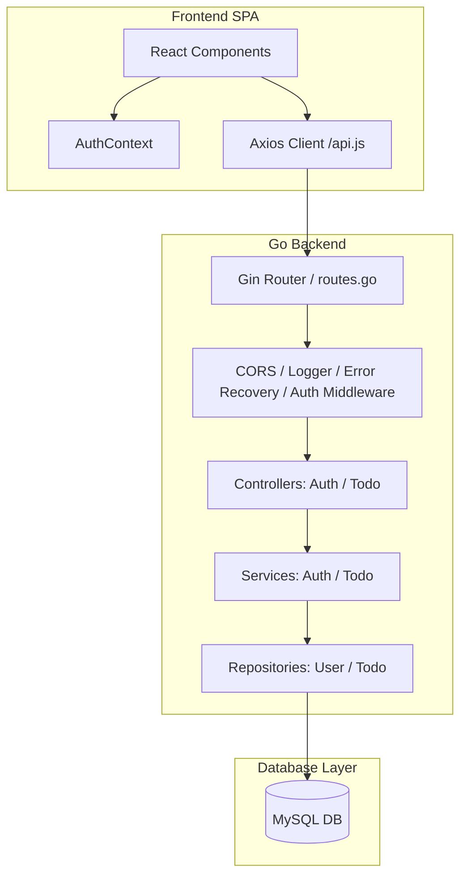
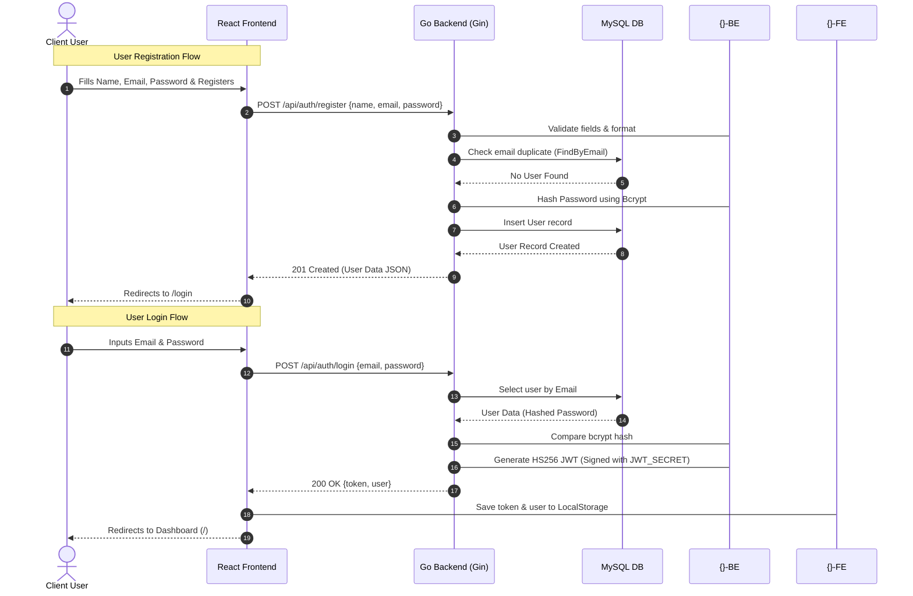
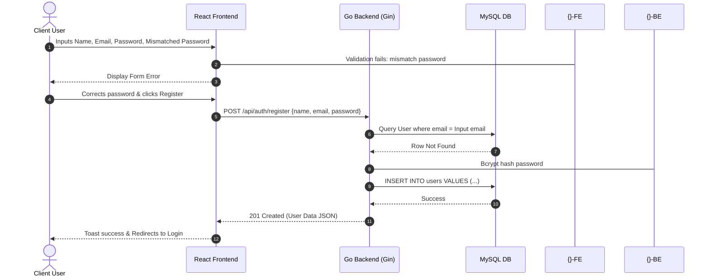
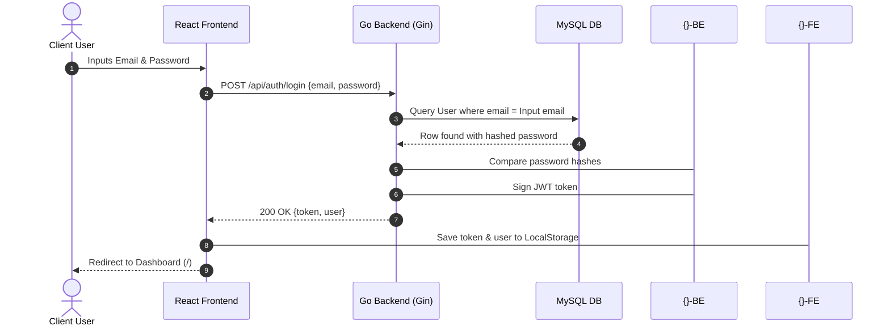
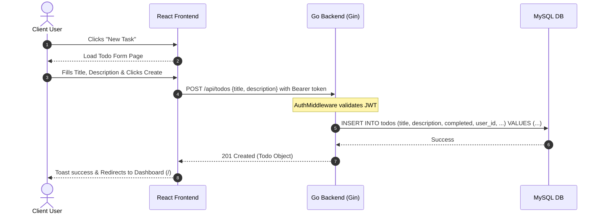
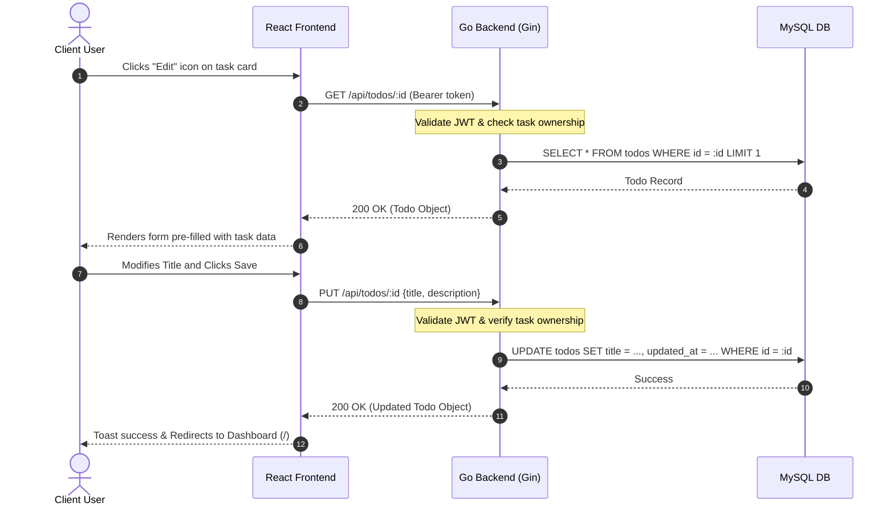
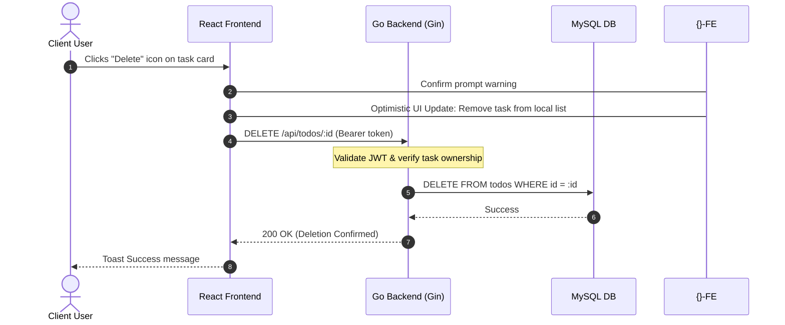
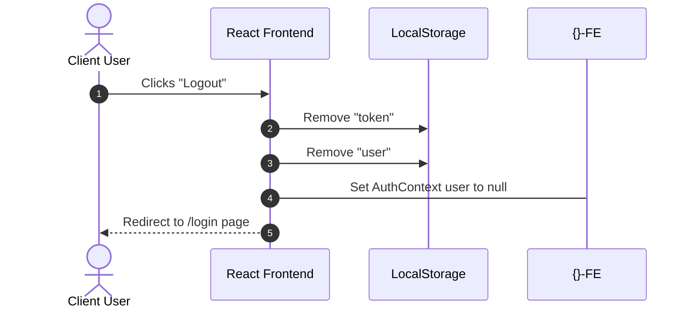

# Technical Walkthrough & Architecture Document: Todo Application

This document provides a comprehensive analysis of the architecture, data flows, execution cycles, and implementation patterns of the Todo Application.

---

## 1. Application Overview

### Purpose
The Todo Application is a secure, multi-user web-based task management platform. It allows users to register, log in, create tasks, view tasks with filters and pagination, edit task details, toggle completion status, and delete tasks.

### Main Features
1. **User Authentication**: Secure registration and login workflows using client-side JWT persistence and server-side bcrypt password hashing.
2. **Task CRUD Operations**: Creation, reading, updating, and deletion of user-specific tasks.
3. **Advanced Filtering & Pagination**: Search queries, status filtering (all, completed, pending), and server-side pagination to minimize database load.
4. **Optimistic Updates**: Immediate UI updates upon completion-toggling and task deletion, with a revert mechanism on network failure.
5. **Global Error Handling**: Centralized recovery and client-side error notifications (Toast messages).

### Technologies Used
* **Frontend**: React (v18), Vite, React Router DOM (v6), Axios, Lucide React (icons), and CSS Modules for isolated component styling.
* **Backend**: Go (Golang), Gin Gonic (web framework), GORM (Object Relational Mapper), and Go-JWT (`github.com/golang-jwt/jwt/v5`).
* **Database**: MySQL.
* **Security & Utility**: Bcrypt password hashing, JWT authentication, and dotenv configuration management.

### High-Level Architecture
The application is built using a decoupled Client-Server architecture:
* **Presentation Layer (Frontend)**: SPA built in React that routes views, manages global authentication context, coordinates API requests, and executes state updates.
* **API Routing & Middleware Layer (Backend)**: Gin router exposes endpoints, routes CORS request configurations, handles global error recovery, and runs JWT validation.
* **Business Logic Layer (Services)**: Services contain application logic, validations, normalization, and coordinate database queries.
* **Data Access Layer (Repositories)**: Encapsulated GORM repositories executing queries against the MySQL Database.



---

## 2. Project Structure Analysis

Here is the directory structure analysis detailing the purpose and files of each component.

### Root Directory
* [README.md](file:///d:/Todo%20KreditBee/README.md): Project overview, environment setup requirements, and quick-start scripts.
* [docker-compose.yml](file:///d:/Todo%20KreditBee/docker-compose.yml): **Responsibility**: Orchestration configuration. Coordinates the MySQL database (`db`), Go REST API (`backend`), and React frontend server (`frontend`) in an isolated network environment.

### Backend Structure (`/backend`)
* [Dockerfile](file:///d:/Todo%20KreditBee/backend/Dockerfile): **Responsibility**: Docker image recipe. Uses a multi-stage process to compile the Golang source code into a static binary and run it in a clean Alpine container.
* [cmd/main.go](file:///d:/Todo%20KreditBee/backend/cmd/main.go): **Responsibility**: Application entry point. Loads config, establishes the MySQL database pool, auto-migrates tables, sets up router endpoints, and fires up the server.
* [config/config.go](file:///d:/Todo%20KreditBee/backend/config/config.go): **Responsibility**: Configuration loader. Parses environment variables and maps them to a global config struct configuration.
* [database/mysql.go](file:///d:/Todo%20KreditBee/backend/database/mysql.go): **Responsibility**: Database connectivity module. Connects to MySQL using GORM driver and performs schema auto-migration.
* [database/schema.sql](file:///d:/Todo%20KreditBee/backend/database/schema.sql): **Responsibility**: Explicit MySQL DDL schema specifying indices, key constraints, and tables.
* [database/seed.sql](file:///d:/Todo%20KreditBee/backend/database/seed.sql): **Responsibility**: SQL script to populate database with demo users and tasks.
* [models/user.go](file:///d:/Todo%20KreditBee/backend/models/user.go): **Responsibility**: Defines the GORM and JSON mappings for the [User](file:///d:/Todo%20KreditBee/backend/models/user.go) struct.
* [models/todo.go](file:///d:/Todo%20KreditBee/backend/models/todo.go): **Responsibility**: Defines the GORM and JSON mappings for the [Todo](file:///d:/Todo%20KreditBee/backend/models/todo.go) struct.
* [middleware/auth_middleware.go](file:///d:/Todo%20KreditBee/backend/middleware/auth_middleware.go): **Responsibility**: Authorization gatekeeper. Extracts Bearer token, validates claims, and injects user identity into Gin context.
* [middleware/error_middleware.go](file:///d:/Todo%20KreditBee/backend/middleware/error_middleware.go): **Responsibility**: Global panic recovery. Catches unhandled runtime panics and converts them to standard 500 JSON errors.
* [middleware/logger_middleware.go](file:///d:/Todo%20KreditBee/backend/middleware/logger_middleware.go): **Responsibility**: API Request logger recording HTTP status, path, latency, method, and IP.
* [controllers/auth_controller.go](file:///d:/Todo%20KreditBee/backend/controllers/auth_controller.go): **Responsibility**: HTTP handler wrapper for authentication. Binds incoming payload inputs and triggers Auth services.
* [controllers/todo_controller.go](file:///d:/Todo%20KreditBee/backend/controllers/todo_controller.go): **Responsibility**: HTTP handlers for task operations, query parser for pagination/searches, and payload binding.
* [services/auth_service.go](file:///d:/Todo%20KreditBee/backend/services/auth_service.go): **Responsibility**: Enforces password requirements, validates format bounds, checks duplicates, and coordinates hashing/token issuing.
* [services/todo_service.go](file:///d:/Todo%20KreditBee/backend/services/todo_service.go): **Responsibility**: Business logic wrapper around task management, validation, and user ownership validation.
* [repositories/user_repository.go](file:///d:/Todo%20KreditBee/backend/repositories/user_repository.go): **Responsibility**: Direct database operations for querying and persisting users.
* [repositories/todo_repository.go](file:///d:/Todo%20KreditBee/backend/repositories/todo_repository.go): **Responsibility**: Database queries for tasks including pagination math, filters, searches, updates, and deletes.
* [routes/routes.go](file:///d:/Todo%20KreditBee/backend/routes/routes.go): **Responsibility**: Declares paths, sets CORS policy, executes dependency injection, and connects controllers to routes.
* [utils/jwt.go](file:///d:/Todo%20KreditBee/backend/utils/jwt.go): **Responsibility**: Signs HS256 tokens and decodes claims.
* [utils/password.go](file:///d:/Todo%20KreditBee/backend/utils/password.go): **Responsibility**: Bcrypt wrapper for encryption and verification checks.

### Frontend Structure (`/frontend`)
* [Dockerfile](file:///d:/Todo%20KreditBee/frontend/Dockerfile): **Responsibility**: Docker image recipe. Builds the production bundle of the React app using Node environment and packages it inside an Nginx container.
* [nginx.conf](file:///d:/Todo%20KreditBee/frontend/nginx.conf): **Responsibility**: Nginx configuration. Handles frontend static asset delivery and redirects SPA routes to `index.html`.
* [main.jsx](file:///d:/Todo%20KreditBee/frontend/src/main.jsx): React mounting execution node.
* [App.jsx](file:///d:/Todo%20KreditBee/frontend/src/App.jsx): Declares page routes, defines public vs protected pathways, and sets Layout wrapper boundaries.
* [index.css](file:///d:/Todo%20KreditBee/frontend/src/index.css): Core global typography, custom scrollbars, spin animations, and foundational design rules.
* [context/AuthContext.jsx](file:///d:/Todo%20KreditBee/frontend/src/context/AuthContext.jsx): Context API provider managing user authentication state, logins, registrations, and logouts.
* [services/api.js](file:///d:/Todo%20KreditBee/frontend/src/services/api.js): Configure axios client, adds authentication headers globally via request interceptors, and redirects user to login on 401s via response interceptors.
* `components/ProtectedRoute.jsx`: Gated entry component that evaluates authentication status and redirects guest accesses to `/login`.
* `components/Layout/Layout.jsx`: Application layout structure featuring a sidebar navigation, header context, mobile navigation drawer, and slot content injection.
* `components/Toast/Toast.jsx`: Time-dismissed, stylized banner component indicating success or failure events.
* `pages/Login/LoginPage.jsx`: User entry credentials form with client-side validation logic.
* `pages/Register/RegisterPage.jsx`: Direct account registration page validating password matches and text inputs.
* `pages/Dashboard/DashboardPage.jsx`: Task control panel implementing search input debouncing, status filters, lists of task cards, and pagination controls.
* `pages/TodoForm/TodoFormPage.jsx`: Shared form supporting both creation and update phases. Uses parameters to toggle between create and edit mode.
* `pages/Profile/ProfilePage.jsx`: Renders user details from global state.

---

## 3. Frontend Workflow

### Startup & Mounting
1. **Index Initialization**: The browser loads `/index.html` which loads [main.jsx](file:///d:/Todo%20KreditBee/frontend/src/main.jsx).
2. **Provider Wrapping**: [main.jsx](file:///d:/Todo%20KreditBee/frontend/src/main.jsx) mounts `<App />` within `React.StrictMode`.
3. **Context Bootstrapping**: [App.jsx](file:///d:/Todo%20KreditBee/frontend/src/App.jsx) establishes `<BrowserRouter>` and wraps it inside `<AuthProvider>` from [AuthContext.jsx](file:///d:/Todo%20KreditBee/frontend/src/context/AuthContext.jsx).
4. **Token Check**: `<AuthProvider>` triggers its `useEffect` hook:
   * It checks `localStorage` for `token` and `user` data.
   * If both are present, it updates the state `user` using `setUser(JSON.parse(storedUser))`.
   * It sets the `loading` state to `false`.

### Routing Flow
* Public paths `/login` and `/register` bypass authorization gates.
* Protected paths `/`, `/create`, `/edit/:id`, and `/profile` are enclosed by `<ProtectedRoute>` and `<Layout>`:
  * If `loading` is true, `<ProtectedRoute>` renders a loading spinner.
  * If `user` is null, it renders `<Navigate to="/login" replace />`.
  * If `user` is authenticated, it mounts the page components inside `<Layout>`.

### Authentication Flow
1. **Validation & Request**: When credentials are submitted via [LoginPage.jsx](file:///d:/Todo%20KreditBee/frontend/src/pages/Login/LoginPage.jsx), it triggers `login(email, password)` in [AuthContext.jsx](file:///d:/Todo%20KreditBee/frontend/src/context/AuthContext.jsx).
2. **Response Persistence**: On HTTP success, the context writes `token` and JSON-serialized `user` data to `localStorage`, updates the `user` state, and returns `{ success: true }`.
3. **Redirect**: The page intercepts the success response and triggers `navigate('/')`.
4. **Logout Lifecycle**: Triggering the logout button calls `logout()` in the context which removes storage keys, updates `setUser(null)`, and redirects to `/login`.

### State Management Flow
* **Global Auth State**: Managed in [AuthContext.jsx](file:///d:/Todo%20KreditBee/frontend/src/context/AuthContext.jsx) via React context hook.
* **Local Component State**: Managed via standard `useState` hooks for search filters, forms, loadings, alerts, and pages.
* **Sync Strategy**: Fetch triggers are executed by page hooks reacting to variable changes (e.g. page or search filters change in Dashboard).

### API Communication Flow
* Utilizes [api.js](file:///d:/Todo%20KreditBee/frontend/src/services/api.js) wrapper for all endpoints.
* Automatic injection of JWT token using Axios request interceptors.
* Centralized handling of unauthorized requests (401 errors) in Axios response interceptors to clear local storage and force redirect to login page.

---

### Page Details & User Interactions

#### 1. Login Page
* **User Actions**: User types email/password, submits form, or clicks registration link.
* **Validation**:
  * Mandatory field presence checks.
  * Basic regex verification (`/\S+@\S+\.\S+/`) for email formats.
* **API Requests**: Triggers `POST /api/auth/login` containing `email` and `password`.
* **State Updates**:
  * Form field states updated via `onChange`.
  * Form validation errors written to `errors` state object.
  * `loading` toggled true during transit.
  * Successful authentications update the global `user` context.
* **Navigation**: On success, redirects user to `/`. On validation error or failure, displays Toast notification.

#### 2. Register Page
* **User Actions**: Fills out registration form (name, email, password, and confirmation).
* **Validation**:
  * Verifies non-empty name.
  * Validates email format.
  * Ensures password is at least 8 characters.
  * Matches `password` against `confirmPassword`.
* **API Requests**: Calls `POST /api/auth/register` with `name`, `email`, and `password`.
* **State Updates**:
  * Local form values updated.
  * Errors populated on mismatch.
* **Navigation**: Upon successful creation, triggers success Toast and navigates user to `/login` after a `1.5s` delay.

#### 3. Dashboard
* **User Actions**:
  * Type in search box (triggers debounced execution after 300ms).
  * Toggle completion checkboxes.
  * Click task edit/delete buttons.
  * Click page pagination controls.
  * Filter list by all, completed, or pending tasks.
* **API Requests**:
  * `GET /api/todos?page=...&limit=...&completed=...&search=...` (fetches tasks).
  * `PATCH /api/todos/:id/complete` (toggles task status).
  * `DELETE /api/todos/:id` (removes task).
* **State Updates**:
  * `todos` and `totalCount` are updated from API response.
  * Optimistic UI updates update local lists instantly for deletes and status changes, reverting back via `fetchTodos()` if the API request fails.
* **Navigation**: Edit click redirects to `/edit/:id`. Create Task redirects to `/create`.

#### 4. Create Todo Page
* **User Actions**: Types task title and description, clicks "Create Task", or clicks "Back".
* **Validation**: Title presence validation (cannot be empty).
* **API Requests**: `POST /api/todos` with body containing `{ title, description }`.
* **State Updates**:
  * Local input values updated.
  * Errors updated on validation check failure.
  * `loading` set to true during submit execution.
* **Navigation**: Redirects back to `/` after 1 second of successful creation.

#### 5. Edit Todo Page
* **User Actions**: Modifies title or description, clicks "Save Changes".
* **Validation**: Title is required.
* **API Requests**:
  * `GET /api/todos/:id` on mount to pre-fill inputs.
  * `PUT /api/todos/:id` on submit with updated values.
* **State Updates**:
  * `fetching` set to true while loading initial details.
  * Pre-fills local form inputs with fetched data.
  * Updates form fields on typing.
* **Navigation**: Returns to dashboard on successful save or if the todo fails to load.

#### 6. Profile Page
* **User Actions**: Navigate to page to view user details.
* **Validation**: None (read-only presentation).
* **API Requests**: None (reads profile context populated at authentication).
* **State Updates**: Reads static values `name`, `email`, and `id` directly from `AuthContext`.

---

## 4. Backend Workflow

This section outlines how requests map through the backend.

### Request Pipeline Stages
1. **Entry**: Router matches request pattern defined in [routes.go](file:///d:/Todo%20KreditBee/backend/routes/routes.go).
2. **Global Middlewares**:
   * Logs HTTP metadata using [LoggerMiddleware](file:///d:/Todo%20KreditBee/backend/middleware/logger_middleware.go).
   * Catches runtime panic events using [ErrorRecoveryMiddleware](file:///d:/Todo%20KreditBee/backend/middleware/error_middleware.go).
   * Sets CORS headers on response.
3. **Route-Specific Middleware**: Authenticated routes pass through [AuthMiddleware](file:///d:/Todo%20KreditBee/backend/middleware/auth_middleware.go). This middleware validates the JWT and sets the `userID` value in the Gin context.
4. **Controller Routing**: Matches endpoint path and passes command inputs into controller action methods (e.g. `todoController.GetTodos`).
5. **Payload Bindings**: Handlers parse query params or parse JSON payloads into structured structs (e.g. `TodoInput`).
6. **Service Layer Execution**: Controllers delegate execution tasks to the services layer (e.g. `TodoService`).
7. **Repository Execution**: The service delegates database actions to repositories using GORM interfaces.
8. **Response Generation**: Controllers construct standard success or failure JSON payloads.
9. **CORS/Logs Finalization**: The response is returned to the client and logged to stdout.

---

### Endpoint Detailed Workflow Analysis

#### 1. `POST /api/auth/register`
* **Route**: `/api/auth/register` -> `AuthController.Register`
* **Middleware**: Logger, Recovery, CORS.
* **Controller**: Parses JSON into `RegisterInput`. Performs field validation (required, email, min=8). Passes to `authService.Register`.
* **Service**: Normalizes input (lowercases email). Verifies format using regex. Checks for existing users via `userRepo.FindByEmail`. Hashes password via `bcrypt`. Calls `userRepo.Create`.
* **Repository**: Runs GORM insert command: `r.db.Create(user)`.
* **DB Query**: `INSERT INTO users (name, email, password, created_at) VALUES (?, ?, ?, ?)`.
* **Response**: Returns `201 Created` with success status and user data (excluding password).

#### 2. `POST /api/auth/login`
* **Route**: `/api/auth/login` -> `AuthController.Login`
* **Middleware**: Logger, Recovery, CORS.
* **Controller**: Binds JSON into `LoginInput`. Verifies email format with regexp. Calls `authService.Login`.
* **Service**: Lowercases email. Fetches user from DB via `userRepo.FindByEmail`. Verifies password hash using bcrypt. Generates JWT with 24h expiration on success.
* **Repository**: `r.db.Where("email = ?", email).First(&user)`.
* **DB Query**: `SELECT * FROM users WHERE email = ? LIMIT 1`.
* **Response**: Returns `200 OK` containing signed token string and user info object.

#### 3. `GET /api/todos`
* **Route**: `/api/todos` -> `TodoController.GetTodos`
* **Middleware**: Logger, Recovery, CORS, AuthMiddleware (extracts `userID` from Bearer token).
* **Controller**: Extracts `userID` from context. Parses query filters: `completed`, `search`, `page`, `limit`. Calls `todoService.GetTodos`.
* **Service**: Passes pagination arguments to `todoRepo.FindAllByUserID`.
* **Repository**: Dynamically constructs SQL based on search and completion filters. Counts total tasks first, then queries page items using `limit` and `offset`.
* **DB Query**:
  * `SELECT count(*) FROM todos WHERE user_id = ? AND completed = ? AND (title LIKE ? OR description LIKE ?)`
  * `SELECT * FROM todos WHERE user_id = ? AND completed = ? AND (title LIKE ? OR description LIKE ?) ORDER BY created_at desc LIMIT ? OFFSET ?`
* **Response**: Returns `200 OK` containing matching tasks array and total items count.

#### 4. `GET /api/todos/:id`
* **Route**: `/api/todos/:id` -> `TodoController.GetTodoByID`
* **Middleware**: Logger, Recovery, CORS, AuthMiddleware.
* **Controller**: Parses ID parameter to unsigned integer. Passes ID to `todoService.GetTodoByID`.
* **Service**: Fetches todo from repository. Validates task ownership: returns unauthorized error if `todo.UserID != userID`.
* **Repository**: Fetches task via `todoRepo.FindByID`.
* **DB Query**: `SELECT * FROM todos WHERE id = ? LIMIT 1`.
* **Response**: Returns `200 OK` with task data on success, `404 Not Found` if task is missing, or `403 Forbidden` on ownership mismatch.

#### 5. `POST /api/todos`
* **Route**: `/api/todos` -> `TodoController.CreateTodo`
* **Middleware**: Logger, Recovery, CORS, AuthMiddleware.
* **Controller**: Binds request body payload to `TodoInput`. Validates title presence. Calls `todoService.CreateTodo`.
* **Service**: Creates a `Todo` model instance with `Completed` set to `false`. Calls `todoRepo.Create`.
* **Repository**: Inserts the new record into the database.
* **DB Query**: `INSERT INTO todos (title, description, completed, user_id, created_at, updated_at) VALUES (?, ?, ?, ?, ?, ?)`.
* **Response**: Returns `201 Created` with the newly created todo object.

#### 6. `PUT /api/todos/:id`
* **Route**: `/api/todos/:id` -> `TodoController.UpdateTodo`
* **Middleware**: Logger, Recovery, CORS, AuthMiddleware.
* **Controller**: Parses route ID and JSON body payload. Calls `todoService.UpdateTodo`.
* **Service**: Fetches existing todo to verify ownership. Updates title and description. Calls `todoRepo.Update`.
* **Repository**: Persists modified record via `r.db.Save(todo)`.
* **DB Query**: `UPDATE todos SET title = ?, description = ?, updated_at = ? WHERE id = ?`.
* **Response**: Returns `200 OK` with updated todo data.

#### 7. `DELETE /api/todos/:id`
* **Route**: `/api/todos/:id` -> `TodoController.DeleteTodo`
* **Middleware**: Logger, Recovery, CORS, AuthMiddleware.
* **Controller**: Parses route ID. Calls `todoService.DeleteTodo`.
* **Service**: Fetches task to verify ownership. Calls `todoRepo.Delete`.
* **Repository**: Deletes record via `r.db.Delete(&Todo{}, id)`.
* **DB Query**: `DELETE FROM todos WHERE id = ?`.
* **Response**: Returns `200 OK` confirming deletion.

#### 8. `PATCH /api/todos/:id/complete`
* **Route**: `/api/todos/:id/complete` -> `TodoController.ToggleCompleteTodo`
* **Middleware**: Logger, Recovery, CORS, AuthMiddleware.
* **Controller**: Parses ID. Calls `todoService.ToggleCompleteTodo`.
* **Service**: Fetches existing todo to verify ownership. Toggles the `Completed` boolean state. Calls `todoRepo.Update`.
* **Repository**: Saves modified todo.
* **DB Query**: `UPDATE todos SET completed = ?, updated_at = ? WHERE id = ?`.
* **Response**: Returns `200 OK` containing updated status.

---

## 5. Authentication Workflow



### Authentication Core Mechanisms
* **Password Hashing**: Uses `bcrypt.GenerateFromPassword` with `DefaultCost` (cost factor 10) in [password.go](file:///d:/Todo%20KreditBee/backend/utils/password.go) to hash passwords before database insertion.
* **JWT Generation**: Generates standard HS256 tokens using [jwt.go](file:///d:/Todo%20KreditBee/backend/utils/jwt.go). The payload includes the authenticated `user_id` as a claim along with an expiry timestamp (`ExpiresAt`) set to 24 hours from issuance.
* **JWT Token Validation**: The backend parses incoming tokens via `jwt.ParseWithClaims` with security signature validation against `JWTSecret`.
* **Protected Routes Access Control**: The backend's [AuthMiddleware](file:///d:/Todo%20KreditBee/backend/middleware/auth_middleware.go) intercepts requests to `/api/todos/*`. It parses the HTTP `Authorization` header, extracts the `Bearer <token>` string, validates the token, and sets the parsed user ID in the request context using `c.Set("userID", claims.UserID)`. If the token is invalid or missing, it aborts the request pipeline with a `401 Unauthorized` response.
* **Logout Handling**: Fully client-side operation. Clicking logout calls the `logout()` context function which deletes `'token'` and `'user'` keys from `localStorage` and updates the React user state to `null`. This state change immediately triggers `<ProtectedRoute>` to render a redirect back to `/login`.

---

## 6. Todo Management Workflow

This section traces the execution path of Todo-related operations across all layers.

### 1. Create Todo Flow
1. **User Action**: The user fills out the task form on `/create` and clicks submit.
2. **Client Validation**: The frontend validates that the title is not empty.
3. **API Request**: Axios sends a `POST` request to `/api/todos` containing the task title and description. The request automatically includes the authorization token in the headers via the request interceptor.
4. **Backend Route & Middleware Validation**: The request is routed to `todoController.CreateTodo` after passing through `AuthMiddleware`.
5. **Controller Binding**: Binds JSON payload inputs to `TodoInput` struct and validates title field.
6. **Service Logic**: Instantiate a new `models.Todo` struct with target parameters and `Completed = false`. Passes execution to `todoRepo.Create`.
7. **Repository Save**: `r.db.Create(todo)` executes query on MySQL instance.
8. **Response Return**: Backend returns `201 Created` status with the new todo object.
9. **UI Sync**: The client receives a success status, displays a Toast notification, and navigates back to `/`.

### 2. Get Todos Flow
1. **Mount/Filter Trigger**: Dashboard loads or query parameters (search query, completion filter, or page pagination) update.
2. **API Request**: Frontend triggers Axios `GET` request to `/api/todos?page=...&limit=...&completed=...&search=...`.
3. **Auth Middleware validation**: Context `userID` token claims validated.
4. **Controller Processing**: Extracts `page` and `limit` from request parameters. Compares query strings to calculate database offsets: `(page - 1) * limit`.
5. **Service Layer**: Delegated arguments parsed directly to repository.
6. **Repository Queries**:
   * Evaluates completion filter and searches variables to build a dynamic SQL query using `r.db.Model(&Todo{})`.
   * Triggers `.Count(&total)` query.
   * Executes `.Limit(limit).Offset(offset).Order("created_at desc").Find(&todos)` to fetch the current page of tasks.
7. **Response**: Returns `200 OK` containing a list of tasks and the total count.
8. **UI Rendering**: Dashboard updates state hooks, stops showing loading states, and renders task items.

```
+----------+      GET /api/todos?page=1      +------------+      Count & Fetch      +----------+
| Frontend | ------------------------------> | Go Backend | ----------------------> | MySQL DB |
|          | <------------------------------ |  (GORM)    | <---------------------- |          |
+----------+        JSON Array + Total       +------------+     ResultSet & Count   +----------+
```

### 3. Update Todo Flow
1. **Form Load**: Edit Page requests `GET /api/todos/:id` on mount to pre-fill form fields.
2. **User Submit**: User modifies fields and submits.
3. **API Request**: Triggers `PUT /api/todos/:id` with new title and description values.
4. **Backend Middleware verification**: User claims validated via middleware.
5. **Controller Processing**: Binds route param ID and JSON payload. Calls service layer.
6. **Service Logic Validation**: Fetches task details from repository by ID and verifies task ownership: `todo.UserID == userID`. If correct, updates fields and calls `todoRepo.Update`.
7. **Repository Execution**: Calls `r.db.Save(todo)`.
8. **DB Update**: Updates the task title and description fields in the database.
9. **Response**: Returns `200 OK` with updated todo data.
10. **Navigation**: Frontend displays success Toast and redirects to dashboard.

### 4. Toggle Status (Complete) Flow
1. **User Action**: Clicking the checkbox on a task card triggers the toggle handler.
2. **Optimistic UI Update**: The frontend immediately updates the local task list state to show the updated completion status before receiving the API response.
3. **API Request**: Axios sends a `PATCH` request to `/api/todos/:id/complete`.
4. **Backend Route Validation**: Handled by `todoController.ToggleCompleteTodo` after JWT authentication.
5. **Ownership Check**: Service layer fetches the task, verifies ownership, and toggles the `Completed` boolean status field.
6. **Repository Save**: Save updated record via `r.db.Save(todo)`.
7. **Response**: Returns `200 OK` with updated task data.
8. **Error Recovery**: If the API call fails, the client catches the error, displays an error Toast, and calls `fetchTodos()` to revert the checkbox to its previous state.

### 5. Delete Todo Flow
1. **User Action**: Clicking the trash icon triggers the delete handler. The user is prompted to confirm the deletion.
2. **Optimistic UI Update**: The frontend instantly removes the task from the local state list.
3. **API Request**: Axios sends a `DELETE` request to `/api/todos/:id`.
4. **Backend Processing**: Handled by `todoController.DeleteTodo` after passing authentication middleware.
5. **Service Layer validation**: Fetches target item, verifies ownership, and deletes record.
6. **Repository Execution**: Deletes task via GORM: `r.db.Delete(&models.Todo{}, id)`.
7. **Response**: Returns `200 OK` with success status.
8. **Error Recovery**: If the API request fails, the client catches the error, displays an error Toast, and calls `fetchTodos()` to restore the deleted task to the list.

---

## 7. Database Workflow

This section describes the database schema, table structures, and relationships.

### Schema Table Definitions

#### `users` Table
```sql
CREATE TABLE IF NOT EXISTS `users` (
    `id` INT UNSIGNED AUTO_INCREMENT PRIMARY KEY,
    `name` VARCHAR(100) NOT NULL,
    `email` VARCHAR(191) NOT NULL,
    `password` VARCHAR(255) NOT NULL,
    `created_at` TIMESTAMP DEFAULT CURRENT_TIMESTAMP,
    UNIQUE KEY `idx_users_email` (`email`)
) ENGINE=InnoDB DEFAULT CHARSET=utf8mb4 COLLATE=utf8mb4_unicode_ci;
```

#### `todos` Table
```sql
CREATE TABLE IF NOT EXISTS `todos` (
    `id` INT UNSIGNED AUTO_INCREMENT PRIMARY KEY,
    `title` VARCHAR(255) NOT NULL,
    `description` TEXT,
    `completed` BOOLEAN DEFAULT FALSE,
    `user_id` INT UNSIGNED NOT NULL,
    `created_at` TIMESTAMP DEFAULT CURRENT_TIMESTAMP,
    `updated_at` TIMESTAMP DEFAULT CURRENT_TIMESTAMP ON UPDATE CURRENT_TIMESTAMP,
    CONSTRAINT `fk_todos_users` FOREIGN KEY (`user_id`) REFERENCES `users` (`id`) ON DELETE CASCADE
) ENGINE=InnoDB DEFAULT CHARSET=utf8mb4 COLLATE=utf8mb4_unicode_ci;
```

### Table Relationships
* **Relationship**: One-to-Many relationship between `users` and `todos`. A single user can have multiple tasks, while each task belongs to exactly one user.
* **Foreign Key**: `todos.user_id` references `users.id`.
* **Constraint**: `ON DELETE CASCADE` is set on the foreign key relationship. Deleting a user automatically deletes all associated tasks in the database to prevent orphaned records.
* **Indexes**:
  * Unique index `idx_users_email` on `users(email)` for fast logins and to prevent duplicate registrations.
  * Index `idx_todos_user_id` on `todos(user_id)` for quick task lookups by user ID.
  * Index `idx_todos_completed` on `todos(completed)` to optimize task filtering by status.

---

## 8. API Communication Flow

### Axios Configuration
The client-side API communication is configured in [api.js](file:///d:/Todo%20KreditBee/frontend/src/services/api.js):
```javascript
const API = axios.create({
  baseURL: import.meta.env.VITE_API_URL + '/api',
  headers: {
    'Content-Type': 'application/json',
  },
});
```

### Interceptors
* **Request Interceptor**: Checks if a JWT token is stored in local storage and automatically attaches it to the request headers:
  ```javascript
  API.interceptors.request.use((config) => {
    const token = localStorage.getItem('token');
    if (token) {
      config.headers.Authorization = `Bearer ${token}`;
    }
    return config;
  });
  ```
* **Response Interceptor**: Intercepts responses and simplifies API error handling:
  * On success: Returns `response.data` directly to simplify data access in components.
  * On error:
    * Intercepts `401 Unauthorized` responses (indicating expired or invalid tokens), clears local storage, and redirects the user to the login page (`window.location.href = '/login'`).
    * Rejects other API errors with a descriptive error message from the backend response.

---

### Step-by-Step API Request Trace (Toggle Completion Status)

Here is a trace of the toggle status request from the client's click action to the database update:

```
[UI Checkbox Clicked]
        │
        ▼ (Optimistic UI Update: Local list updated immediately)
[Axios Client: api.js]
        │ (Appends "Authorization: Bearer <token>" header)
        ▼ (Sends PATCH request to "/api/todos/:id/complete")
[Go Server: main.go]
        │ (Logger & Error middlewares process request)
        ▼
[AuthMiddleware]
        │ (Parses JWT from header & validates claims)
        ▼ (Sets "userID" in Gin context)
[TodoController.ToggleCompleteTodo]
        │ (Parses task ID parameter from route)
        ▼
[TodoService.ToggleCompleteTodo]
        │ (Fetches task & verifies ownership: todo.UserID == userID)
        ▼ (Toggles completed boolean value)
[TodoRepository.Update]
        │
        ▼ (Executes GORM save query)
[MySQL DB Engine]
        │ (Executes: UPDATE todos SET completed = 1, updated_at = NOW() WHERE id = 12)
        ▼
[Go Server: Return Response]
        │ (Returns JSON: {"success": true, "message": "...", "data": {...}})
        ▼
[Axios Client: Interceptor]
        │ (Resolves promise with response data)
        ▼
[UI View Updated]
```

---

## 9. State Management Workflow

### Global State vs. Local Component State

The application splits state between global context and local component states to ensure separation of concerns:

| State Scope | Managed By | Fields / State Variables | Key Components Using It |
| :--- | :--- | :--- | :--- |
| **Global Auth State** | `AuthContext` | `user` (object), `loading` (boolean) | `ProtectedRoute`, `Layout`, `LoginPage`, `RegisterPage` |
| **Local Dashboard State** | `DashboardPage` | `todos` (array), `search` (string), `statusFilter` (string), `currentPage` (number) | `DashboardPage` |
| **Local Form State** | `TodoFormPage` | `formData` (title, description), `errors` (object), `fetching` (boolean) | `TodoFormPage` |

### Data Flow Diagram

The diagram below shows how state flows between the global context and local components:

```
┌────────────────────────────────────────────────────────┐
│                      AuthContext                       │
├────────────────────────────────────────────────────────┤
│  State: { user: { id: 1, name: "John" }, loading }    │
│  Functions: login(), register(), logout()              │
└───────────┬────────────────────────────────┬───────────┘
            │                                │
            │ Read user                      │ Read user / Trigger logout
            ▼                                ▼
┌───────────────────────┐        ┌───────────────────────┐
│     ProtectedRoute    │        │         Layout        │
├───────────────────────┤        ├───────────────────────┤
│ Checks authorization  │        │ Renders sidebar,      │
│ Redirects on null     │        │ header, & user avatar │
└───────────────────────┘        └───────────────────────┘
                                             │
                                             │ Renders children
                                             ▼
                                 ┌───────────────────────┐
                                 │     DashboardPage     │
                                 ├───────────────────────┤
                                 │ State: { todos, page }│
                                 │ Sync: fetchTodos()    │
                                 └───────────────────────┘
```

---

## 10. End-to-End User Journey

This section traces a user's journey through the application, from opening the login page to logging out:

1. **Open Application**:
   * User navigates to `/`.
   * Router loads [App.jsx](file:///d:/Todo%20KreditBee/frontend/src/App.jsx) and mounts components.
   * `ProtectedRoute` detects that no user or token exists in local storage and redirects the user to `/login`.
2. **Access Login View**:
   * [LoginPage.jsx](file:///d:/Todo%20KreditBee/frontend/src/pages/Login/LoginPage.jsx) loads.
   * User enters credentials ("john@example.com", "password123").
   * User clicks "Login".
3. **Form Submission & Authentication**:
   * Frontend validates input formats.
   * Login request is sent: `POST /api/auth/login`.
   * Backend database verifies the email exists and checks the password hash using bcrypt.
   * JWT is generated and returned to the frontend on success: `{ token: "eyJhb...", user: { id: 1, name: "John" } }`.
4. **Dashboard Render**:
   * Token is saved in local storage and the global `user` context is updated.
   * User is redirected to `/`.
   * `ProtectedRoute` verifies the authenticated session and allows navigation to the dashboard.
   * Dashboard triggers `fetchTodos()` which calls `GET /api/todos?page=1&limit=6`.
   * Dashboard renders the user's tasks.
5. **Create Task**:
   * User clicks "New Task" button.
   * Navigation redirects user to `/create`.
   * User types title ("Send Invoice") and clicks "Create Task".
   * Request sent: `POST /api/todos` (containing JWT header authorization token).
   * Backend inserts task into database and returns a success response.
   * User is redirected back to the dashboard, which refreshes the task list.
6. **Task Actions (Toggle & Delete)**:
   * User checks the checkbox on a task card. The UI immediately marks the task as completed.
   * Request sent: `PATCH /api/todos/:id/complete`. The database updates the task's completion status.
   * User clicks the delete icon on a task and confirms the prompt.
   * Task is immediately removed from the UI, and a delete request is sent: `DELETE /api/todos/:id`.
7. **View User Profile**:
   * User clicks "Profile" in sidebar.
   * Navigation redirects user to `/profile`.
   * [ProfilePage.jsx](file:///d:/Todo%20KreditBee/frontend/src/pages/Profile/ProfilePage.jsx) displays the user's name, email, and ID.
8. **User Logout**:
   * User clicks "Logout" button.
   * Storage keys are cleared and the global `user` context is updated to `null`.
   * `<ProtectedRoute>` detects the session loss and redirects the user back to `/login`.

---

## 11. Sequence Diagrams

### Register


### Login


### Create Todo


### Update Todo


### Delete Todo


### Logout


---

## 12. Error Handling Workflow

The application handles errors across all layers, from input validation to server errors:

### Validation Errors
* **Client-Side Validation**: Handled within components before sending API requests. Mismatches or empty inputs trigger updates to the local component `errors` state, displaying helpful validation error messages next to the affected inputs.
* **Server-Side Validation**: Gin controller methods use `c.ShouldBindJSON` to validate input models (e.g. `RegisterInput`). When validation fails (e.g. password is too short), the controller returns a `400 Bad Request` response with validation error details.

### Authentication Errors
* **Invalid Login Credentials**: If a login attempt fails due to an incorrect email or password, the backend returns a `401 Unauthorized` response with an "invalid email or password" error message. The frontend catches the error and displays the message to the user in a Toast notification.
* **Expired or Missing JWT**: Handled by the backend's [AuthMiddleware](file:///d:/Todo KreditBee/backend/middleware/auth_middleware.go). If a request lacks a valid token, the middleware aborts the request pipeline and returns a `401 Unauthorized` response.
* **Axios Auto-Logout**: The client's Axios response interceptor catches all `401` errors globally, clears local storage to remove the invalid credentials, and redirects the user to the login page.

### Database Errors
* **Duplicate Email Registration**: If a user attempts to register with an email address that already exists, the database throws a unique constraint exception. The backend's [AuthService](file:///d:/Todo%20KreditBee/backend/services/auth_service.go) catches this error, masks the raw SQL database error, and returns a user-friendly "email is already registered" message.
* **Database Connection Failures**: If the database server is unreachable, repository methods return a connection error. The service layer handles this error safely and returns a "database connectivity error" message to avoid exposing raw connection details to the client.

### API & Network Failures
* **Network Failures**: If the API server is unreachable, Axios throws a network error. The response interceptor catches the error, sets a default "Something went wrong. Please try again." error message, and rejects the promise. The frontend page catches the rejection and displays the error message in a Toast notification.
* **Global Server Panic Recovery**: The backend's [ErrorRecoveryMiddleware](file:///d:/Todo%20KreditBee/backend/middleware/error_middleware.go) uses defer-recover blocks to catch any unexpected runtime panics, logs the panic details to stdout for debugging, and returns a standard `500 Internal Server Error` response to the client.

---

## 13. Execution Flow Summary

Below is a summary of the end-to-end execution flow, tracing a user action from the frontend UI all the way through the backend database and back:

| Flow Stage | Layer | Component / File | Execution Action |
| :--- | :--- | :--- | :--- |
| **1. User Action** | Frontend UI | [DashboardPage.jsx](file:///d:/Todo%20KreditBee/frontend/src/pages/Dashboard/DashboardPage.jsx) | User clicks the checkbox on a task card to toggle completion. |
| **2. Optimistic Update** | Frontend View | [DashboardPage.jsx](file:///d:/Todo%20KreditBee/frontend/src/pages/Dashboard/DashboardPage.jsx) | Local task state is immediately updated, toggling the task's checkbox UI. |
| **3. API Call** | Axios Client | [api.js](file:///d:/Todo%20KreditBee/frontend/src/services/api.js) | Sends a `PATCH` request to `/api/todos/:id/complete`. |
| **4. Headers Injection** | Request Interceptor | [api.js](file:///d:/Todo%20KreditBee/frontend/src/services/api.js) | Automatically injects `Authorization: Bearer <token>` header into the request. |
| **5. Entry Gate** | Backend Router | [routes.go](file:///d:/Todo%20KreditBee/backend/routes/routes.go) | Matches path `/api/todos/:id/complete` and routes request to handlers. |
| **6. Request Logger** | Global Middleware | [logger_middleware.go](file:///d:/Todo%20KreditBee/backend/middleware/logger_middleware.go) | Records path and HTTP method in server stdout log. |
| **7. Session Check** | Route Middleware | [auth_middleware.go](file:///d:/Todo%20KreditBee/backend/middleware/auth_middleware.go) | Validates JWT token, extracts User ID, and injects it into Gin context. |
| **8. Controller Action** | Backend Controller | [todo_controller.go](file:///d:/Todo%20KreditBee/backend/controllers/todo_controller.go) | Parses parameters and calls `todoService.ToggleCompleteTodo`. |
| **9. Validation Check** | Business Service | [todo_service.go](file:///d:/Todo%20KreditBee/backend/services/todo_service.go) | Fetches the task and verifies task ownership (`todo.UserID == userID`). |
| **10. SQL Execution** | GORM Repository | [todo_repository.go](file:///d:/Todo%20KreditBee/backend/repositories/todo_repository.go) | Calls GORM save: updates the task's completion status. |
| **11. Database Query** | Database Engine | [mysql.go](file:///d:/Todo%20KreditBee/backend/database/mysql.go) | Runs: `UPDATE todos SET completed = NOT completed WHERE id = ?`. |
| **12. Response Delivery** | HTTP Response | [todo_controller.go](file:///d:/Todo%20KreditBee/backend/controllers/todo_controller.go) | Returns `200 OK` response with updated todo data. |
| **13. UI Sync & Success** | Frontend View | [DashboardPage.jsx](file:///d:/Todo%20KreditBee/frontend/src/pages/Dashboard/DashboardPage.jsx) | displays a success Toast notification to confirm the update. |
